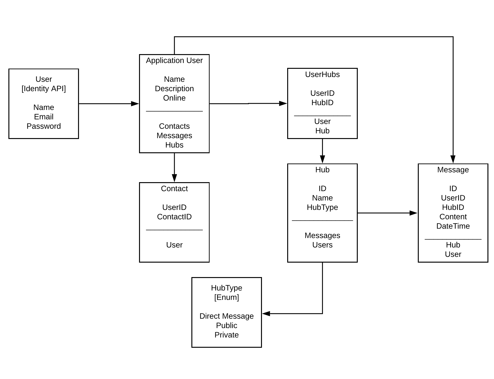

# *Project InstaHub*

## We are deployed on Azure!
Note:  Link below broken.  Feel free to look at the source code though.
[InstaHub](https://instahub.azurewebsites.net)
~~https://instahub.azurewebsites.net~~
```
 Azure trial over.  Setting up new site.  Last update April 30, 2019 -Carlos
```
New website host coming soon.  -July 01, 2019
Will work on deploying when available.  Last update: June 12, 2020
```
https://instahubfamilychat.azurewebsites.net/
```
--------------------------------------------------------------------------------------------------------------------------
###  Web Application
  - This application is a chat messaging program.  The application consist of front-end written in Razor views, JavaScript, CSS, Semantic-UI, and HTML.  The back-end consist was written in C# using ASP.NET Core 2.2.101, Entity Framework Core, MVC framwork, Signal-R.

  - At the landing page, the user is prompted to login using an external Log-In option.  The authorization if handled by [Auth0](https://auth0.com) that handles the security for user authentication and password hashing.

  - The user is then directed to a general-group message window.  In this window, any user logged in the application can submit messages here for anyone using the application can see.  The user also has the option to DM (direct-message) another user that produces a modal (pop-up screen) to then be able to submit messages only to that user and recieve any messages that user might have sent back.
--------------------------------------------------------------------------------------------------------------------------

# Getting Started
1.	Clone the repository to your local machine.
2.	Once downloaded, use Visual Studio 2017 to build the web application.(Note: this was written before 2 months before Visual Studio 2019 is set to be released).
3.  Add-migration and update database to your local machine.
-   The provided code-first migration will need to be applied to the SQL server of your choice.  This requires the Microsoft.EntityFrameworkCore.Tools NuGet package installed from the NuGet Package Manager Console.
-   An update-database will need to be run before running the application.
4.  Auth0 requires Domain, ClientID, and ClientSecret to be used to access the Auth0.
-   You will have to register and provide your own keys/tokens for this access and supply them into your user secrets.
5.	Latest release on March 15, 2019.
-   Once all material is set-up, you may run the application using IIS Express.
--------------------------------------------------------------------------------------------------------------------------

## Database Schema



--------------------------------------------------------------------------------------------------------------------------
## Build and Test
1.  xUnit Testing was run for the back-end.
-   Get & Set for UserGroup Model
-   Get & Set for Message Model
-   Get & Set for Group Model
-   Get & Set for ApplicatioUser

--------------------------------------------------------------------------------------------------------------------------

## Contribute
TODO: Want to help contribute to our code?
- We will assign issues on github issues on what needs to be done.
- Most issues are stretch goals that were not meet.  (Creating groups, direct messages, ect.)
- Keep in mind this is also a learning process for us as well

If you want to learn more about creating good readme files then refer the following [guidelines](https://www.visualstudio.com/en-us/docs/git/create-a-readme). You can also seek inspiration from the below readme files:
- [ASP.NET Core](https://github.com/aspnet/Home)
- [Visual Studio Code](https://github.com/Microsoft/vscode)
- [Chakra Core](https://github.com/Microsoft/ChakraCore)

--------------------------------------------------------------------------------------------------------------------------
## Latest update
```
~~March 15, 2019~~
~~April 30, 2019~~
June 12, 2020
```
I plan on getting this up and running again around Feb 2020.  Depending on workflow.
--------------------------------------------------------------------------------------------------------------------------
# Authors
* [Carlos Castillo](https://github.com/castillocarlosr)
* [Sean Miller](https://github.com/Deliman206)
* [Luther Mckeiver](https://github.com/LutherMckeiver)
* [Andrew Quamme](https://github.com/andrewquamme)
